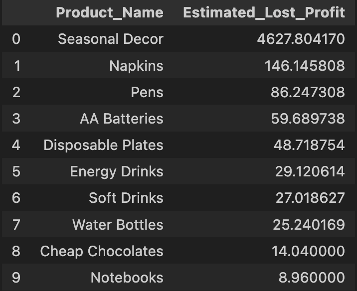
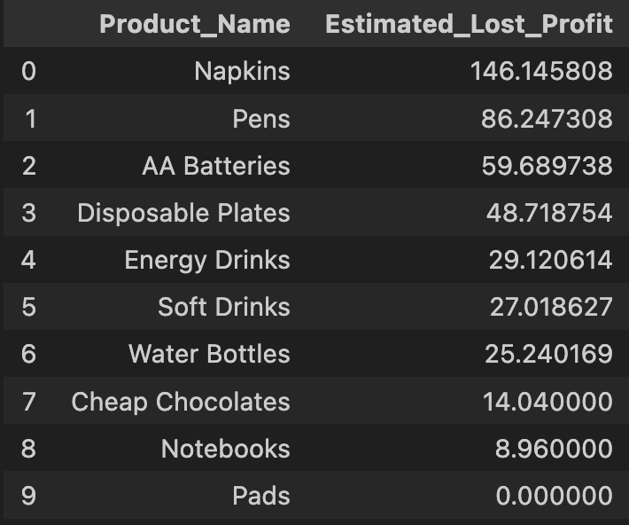
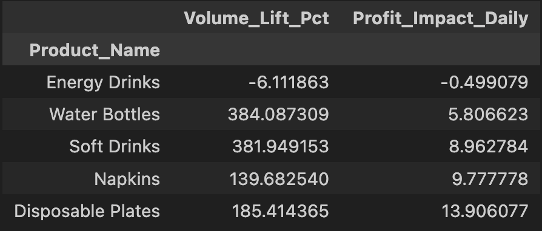

# Retail Inventory Stockout & Profit Loss Analysis

## Introduction

Working in the retail business, I often notice some high demand items being out of stock. I wondered out of curiosity, how much money the business might have lost in this, so I decided to experiment and analyze it.

Since proprietary daily inventory logs are not publicly available, I simulated a synthetic dataset to replicate the constraints of a high-volume discount retailer.
I designed the simulation with specific parameters to ensure realism:

- **Scope:** Focused on the Top 20 High-Demand Products (e.g., Water Bottles, Chocolate, Batteries) that drive daily footfall. SKU hierarchies were excluded to focus purely on core inventory dynamics.
- **Timeframe:** Covered a 6-month period (July–Dec 2025) to capture both steady everyday sales and the busy "Q4 Holiday Surge."
- **Constraints:** Modeled a daily truck restocking schedule but for different products each day to mimic real-world logistical patterns.
- **Schema:** The dataset tracks the daily lifecycle of inventory:
  - Date: The trading day.
  - Product_Name & Category: Item details.
  - Cost_Price & Selling_Price: For margin calculations.
  - Inventory_Start: Opening stock.
  - Restock_Received: Daily delivery quantity.
  - Units_Sold: Recorded sales.
  - Inventory_End: Closing stock (Start + Restock - Sold).
  - Is_Promotion_Active: Marketing campaign flag.

**Data Verification:** Since I simulated the dataset, traditional cleaning wasn't necessary. However, I performed a Exploratory Data Analysis (EDA) on the 3,860 generated rows to verify the logic—confirming that inventory flow was mathematically correct and that stockouts occurred only when demand outpaced supply.

With this validated dataset, I conducted three targeted analyses to quantify the cost of the operational failures.

## Financial Loss Analysis

The simulation revealed that Seasonal Decor is a massive risk. It recorded the highest estimated profit loss, totaling $4,627. This single category accounts for over 90% of the total modeled losses, driven by extreme demand spikes in late October and December that the standard safety stock parameters failed to catch.

**Operational Loss:** When excluding the seasonal outliers, the data highlighted a quieter, systemic failure in steady-selling goods.

- **Napkins:** Recorded a loss of $146, failing consistently throughout the week rather than just during peaks.
- **Pens:** Recorded a loss of $86, indicating a flaw in the weekly replenishment logic for steady-selling stationery items.

## Supply Chain Bottleneck Analysis

**Beverages:** The analysis identified a critical "Sunday" for this category based on the modeled truck schedule.

- **Sunday Stockouts:** Beverages recorded 25 stockout events on Sundays, the highest in the entire dataset.
- **Root Cause:** The simulation proves that a Thursday truck delivery is insufficient to sustain high-velocity sales through the Friday-Sunday weekend rush. The shelves go empty 24 hours before the next delivery arrives.

**Stationery & Snacks:** These categories showed near-zero stockouts, indicating that the current replenishment settings are enough (or holding too much safety stock) relative to demand.

## Promotion Effectiveness Analysis

Stationery items proved most responsive to price cuts in this model.

- **Pads & Notebooks:** Recorded massive volume lifts (>3,500%) and generated positive daily incremental profit, proving high price elasticity.

**Energy Drinks** represented a failed investment.

- **Energy Drinks:** Sales volume actually decreased by 6% during promotions, and daily profit dropped by $0.50, resulting in a net loss.

**Water Bottles** saw a 384% sales increase but generated only $5.80 in extra daily profit due to thin margins. The operational cost of restocking this extra volume likely outweighed the financial gain.

## Conclusions

While this analysis is based on a synthetic dataset, the operational constraints modeled—such as fixed delivery windows and seasonal volatility—closely replicates the reality of high-volume retail. The findings reveal a critical vulnerability: when inventory logic remains static while consumer demand fluctuates, the business suffers from "silent" profit loss, particularly through weekend stockouts and inefficient promotions. Any retailer operating with these patterns risks not only immediate revenue loss but also long-term customer frustration; however, by pivoting to a data-informed strategy that actively aligns replenishment buffers with sales demand, the business can fix these leaks and significantly improve profit & margins.

## Recommendations

- **Weekend Buffer:** Immediately increase the Thursday order quantity for Beverages (Soft Drinks & Water) by 30%. This targets the "Sunday" to capture missed weekend revenue without adding labor costs.
- **Safety Stock Adjustment:** Increase the minimum shelf quantity for Napkins by 15 units to prevent consistent weekly stockouts.
- **Quarter 4:** For the next holiday season, we cannot rely on the algorithm. Manually override the forecast for Seasonal Decor and triple the initial allocation for Halloween and Christmas weeks to prevent the ~$4,600 profit loss observed in this model.
- **Reallocate Budget:** Stop Energy Drink promotions immediately as the data shows they yield negative ROI.
- **Stationery:** Shift the marketing budget to Pads and Notebooks, running monthly "Back-to-School" style promotions to maximize the high-profit lift observed in this category.
